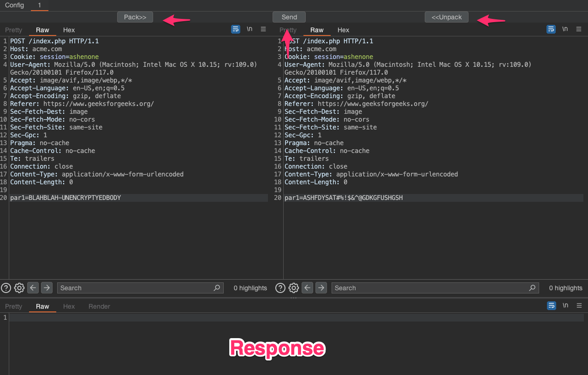

# Ophanim - Burp Extension
## Burp Repeater with Customizable Extra Steps

This extension provides the ability to define custom methods to process HTTP requests before sending them. It is for
situations when an application is encrypting, obfuscating, or otherwise performing anykind of processing on requests.

## Usage
It is intended to be used through writing custom code to carry out the packing/unpacking of the target request
1. Copy the ExampleOculus.java from /examples to /src/main/java/oculos , rename as desired.
2. Define a config class similar to ExampleOculusConfig, a JSON object will be presented to the user through the config tab to provide any config parameters (encryption keys, etc..). 
3. The init method should contain any initialization, and should expect a JSON object that is a serialized instance of the defined config class. 
4. Implement the doPack and doUnpack methods to manipulate the request body.
